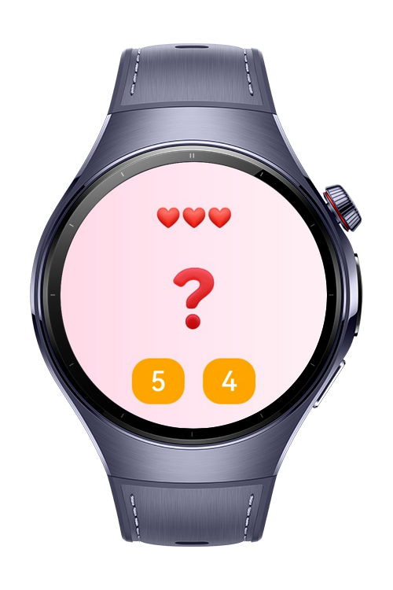
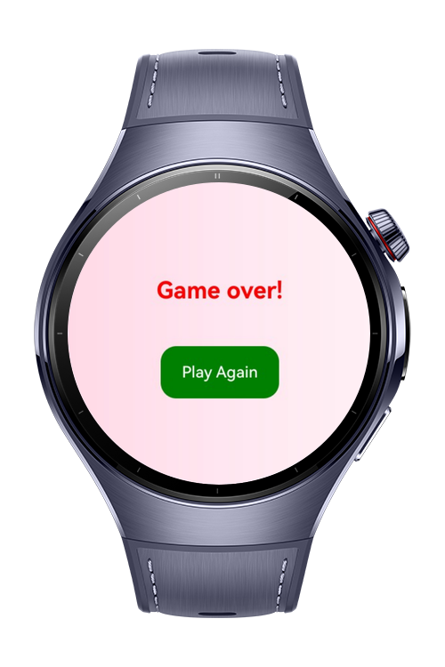

> **Note:** To access all shared projects, get information about environment setup, and view other guides, please visit [Explore-In-HMOS-Wearable Index](https://github.com/Explore-In-HMOS-Wearable/hmos-index).

# Guess the Num Game

**Guess the Num Game** is a lightweight HarmonyOS wearable app that combines UI lifecycle logging with a simple interactive number guessing game. Users try to guess a secret number from two options while managing a limited number of lives. The app also tracks UI lifecycle events and logs them for debugging and educational purposes.

This project demonstrates lifecycle event handling, state management, and user interaction on HarmonyOS wearable devices.

# Preview

<div>
  
  
  
</div>

# Use Cases

- **UI Lifecycle Logging**: Tracks key lifecycle events (`onCreate`, `onWindowStageCreate`, visibility changes) with detailed messages.
- **Number Guessing Game**: Guess the secret number from two choices, with limited lives and game-over conditions.
- **State Persistence**: Lives and game-over state are stored and linked with storage for session consistency.
- **User Feedback**: Displays remaining lives, correct/wrong guesses, and game over messages.
- **Simple and Responsive UI**: Designed for small screens like smartwatches.


# Technology
## Stack
- **Languages**: ArkTS, ArkUI
- **Frameworks**: HarmonyOS SDK 5.0.2(14)
- **Tools**: DevEco Studio Version 5.1.0.828
- **Libraries**:
  - `@kit.ArkUI`
  - `@kit.PerformanceAnalysisKit`

## Required Permissions
- No need to permissions.

# Directory Structure
```
Guess the Num Game
|--- entry/src/main/ets/
| |--- common/
| | |--- util/
| | | |--- GlobalDataStorage.ets
| | | |--- LifecycleLog.ets
| |
| |--- pages/
| | |--- Index.ets
| |
| |--- resources/
| |--- screenshots/
```

# Constraints and Restrictions
## Supported Device

* Huawei Watch 5

# License

**Guess the Num Game** is distributed under the terms of the MIT License
See the [LICENSE](./LICENSE) for more information.


